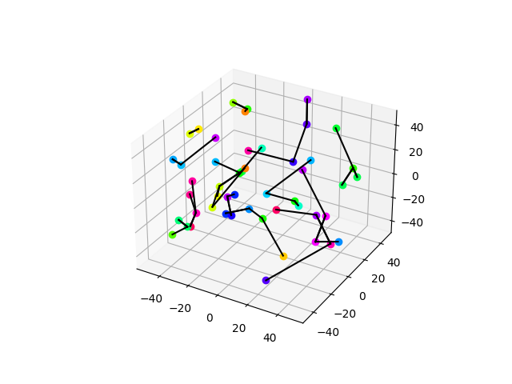

# How to plot quaternions

🐉 Author: Samuele Ferri (@ferrixio)

## What we know about quaternions?

Since quaternions are 4-dimensional objects, we can't represent them using our standard tools, because we live in a 3-dimensional cage. However, with special methods it's possible to project (part of) $\mathbb{H}$ in $\mathbb{R}^3$.

The class doesn't have an initializer, but I added a decorator to check for invalid inputs.

At this moment forward, the word `Iterable` means any iterable object of quaternions.

### :pencil2: The 'standard' way: `plot(Iterable, colored)`

This is the main function to plot quaternions. It splits the 4-dimension in a `3D-space of points + 1D-line of colors`; in mathematical symbols, $\mathbb{H} \simeq \mathbb{R^3} \oplus \mathbb{R}$. The vector part of a quaternion represents the coordinates of a point in $\mathbb{R}^3$, while the real part is used to find a color to paint the point, using _hsv scale_.

The boolean `colored`, if set to False, paints differently the graph. Actually, this list of colors will be graduated from black to red, according to the order of the given quaternions.

At this time, no other args and kwargs are implemented (work in progress).

### :pencil2: The 'relative' way: `distplot(Iterable)`

This particular way evaluates the relative distances among quaternions and plots a bar graph of the minimum distances, sorted by the order in input.

This is wacky and (maybe) useless, but at least shows something about their distances.

### :pencil2: The 'topological' way: `pathplot(Iterable, colored)`

This method is interesting but difficult to understand. It draws a 3-dimensional graph of the list of quaternion, as `plot` do, connected according to the minimum mutual distances among them. As before, the three imaginary parts are coordinates in $\mathbb{R^3}$, while the real part determines the color of the point.

I decide to write this method to add the possibility (in the future) to study the topology of the points. Recently I discovered a branch of mathematics called _topological data analysis_, which amazed me.

At this moment, the method draws constellations of connected colored point in 3D.

### :pencil2: The 'atlas' way: `stereo_prjN(Iterable)` and `stereo_prjS(Iterable)`

The $n$-sphere can be covered by an atlas using only two local charts: the stereographic projections. So a quaternion, as an element of $S^3\subset \mathbb{R^4}$, can be projected in the 3-dimensional space. For the 3-sphere, its **north pole** is the quaternion **1k**, while its **south pole** is **-1k**.

Since the projections are maps $S^3-\{pole\}\to\mathbb{R^3}$, each quaternion will be normalized, in order to be correctly projected.
